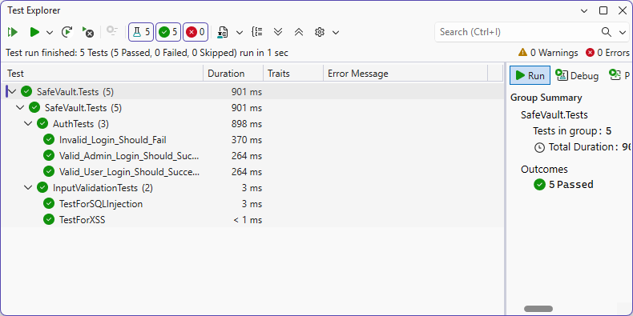

# SafeVault

## Overview
SafeVault is a secure ASP.NET Core Web API application developed to demonstrate secure coding, authentication, authorization, and vulnerability mitigation techniques.

## Security Features

### Input Validation
- User input sanitization
- XSS prevention
- Removal of potentially malicious characters

### SQL Injection Prevention
- Parameterized SQL queries
- Secure database access patterns

### Authentication
- Password hashing using BCrypt
- User credential verification

### Authorization
- Role-Based Access Control (RBAC)
- Admin and User roles
- Protected administrative endpoints

### Test Results

The application was tested against common security vulnerabilities.

- SQL Injection Tests: Passed
- XSS Prevention Tests: Passed
- Authentication Tests: Passed
- Authorization Tests: Passed

See test execution screenshot:

## Technologies
- ASP.NET Core Web API
- NUnit
- BCrypt.Net
- Microsoft Copilot

## Author
Krish Macwan
